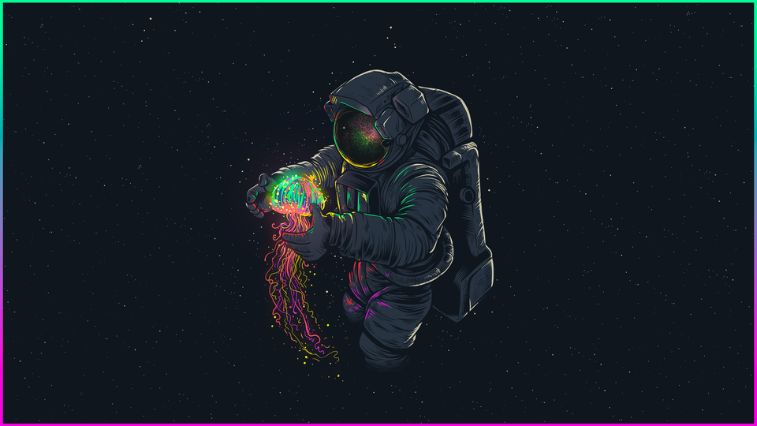

I am Crumbles or most recently thanks to discovering the rev command Murc Wehttam, or what most people call me which is just Matt. I consider myself well on the road to being a Cybersecurity professional. As of writing this I have been on my Cybersecurity journey for roughly 10 months. In that time I have Completed a Cybersecurity bootcamp, reached the top 3% on TryHackMe, participated in my first CTF competition, and most recently passed the CompTIA Security+ certification exam. 

Here you can expect to see me write about things like home lab projects, vulnerable boxes I attempt to crack, cybersecurity tools, scripting projects, and probably a bunch of other fun security stuff as I come across it. I may even blog about creating this blog which will be a learning experience in itself. 

