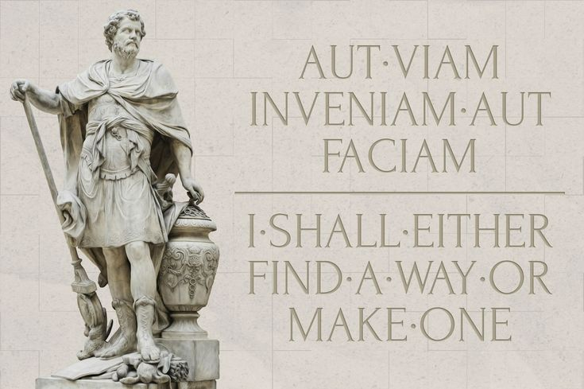

## Who am I?

I am Crumbles. At least online anyway, in real life most people just call me Matt. I am now over 1 year into my Cybersecurity journey and currently working as a Cybersecurity Mentor at Fullstack Academy, the same program that got me interested in the field a little over a year ago. Alongside educating those who choose to follow in my footsteps I have found my true passion lies in Offensive Security and as such that is where my studies are currently directed. Although I have not decided on the specific "path" or "cerfication" within this realm I wish to pursue next I do have a healthy apetite for personal projects. That's where this blog page comes in, ultimately it serves as a portfoilio to showcase all things I work on related to cybersecurity however skewed towards the offensive side that may currently be. 

If you decide to take the time to check out some of my posts feel free to leave a comment. Whether I helped you learn something new or you think this is just the same rehashed content everyone else puts out I'd love to hear it. After all everyone has a blog, bud.
